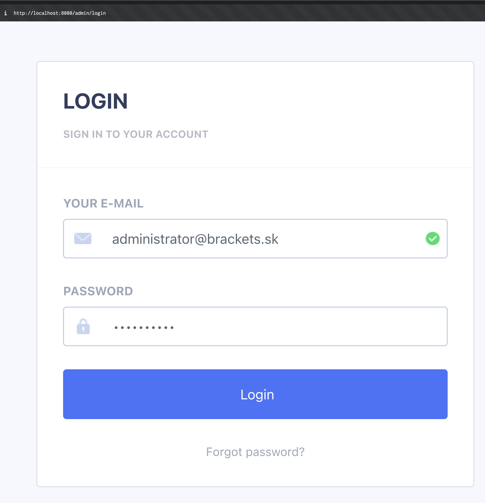

# RentaCar - Car Rental Management System

## About Project

RentaCar is a web-based car rental management system built with Laravel. It allows users to:

-   Browse available vehicles
-   Make reservations
-   Manage bookings
-   Process payments
-   Generate rental reports

## Requirements

Before installing the project, make sure you have the following installed on your system:

-   **PHP** 8.1 or higher
-   **Composer** (PHP dependency manager)
-   **Node.js** and **npm** (for frontend assets)
-   **MySQL** or **PostgreSQL** database
-   **Web server** (Apache, Nginx, or use Laravel's built-in server)

## License

This project is licensed under the MIT License - see the [LICENSE](LICENSE.md) file for details.

## Documentation

-   API Documentation: [storage/api-docs/api-docs.json](storage/api-docs/api-docs.json)

```bash
php artisan l5-swagger:generate
```

-   Privacy Policy: [privacy-policy.md](privacy-policy.md)

## Installation

```bash
composer install
npm install
php artisan key:generate
php artisan migrate
php artisan storage:link
php artisan serve
```

## Admin Setup

After installation, you need to configure the admin user password:

1. In the `admin_users` table, update the `password` field to:

    ```
    $2y$12$coTQm./lIaooQqNl7PSF3.XruKGLgwcUoLj2e5s/3vf99aJmGZOJO
    ```

2. You can now log in with:

    - **Email**: administrator@brackets.sk
    - **Password**: 1234qwerty

3. Access the admin panel at `/admin/login`:


